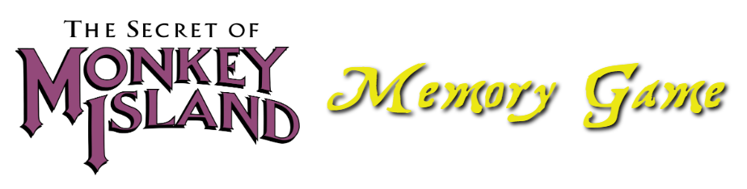

 

This project was the homework for week 19 of the Penn Coding Boot Camp.

## Goal
To create a memory game using ReactJS.

## Installation and Set-up
Please run *npm install* at the root directory after cloning the project.

Then in the command line, run `yarn start`.
You can also use the deployed version of this app at: https://gui365.github.io/MemoryGame/

## Functionality
Click on a character image. Try to click on all 20 characters only once. If you click on the same character twice, you lose the game.

## Objective
* To create a simple ReactJS application using components.

## Built using:
* ReactJS
* CSS
* Bootstrap
* git
* GitHub
* JavaScript

## Authors
**Guillermo Barila** - *Author*
